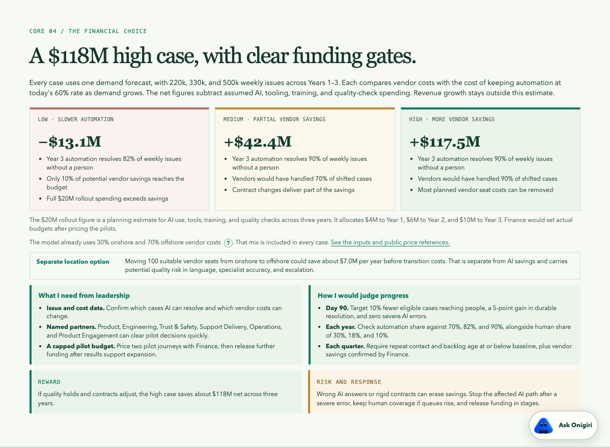

# Albert Chan | Support Operations Lead

**[View the take-home assignment](https://support-operations-albert-chan.albe88948804.chatgpt.site/)** · [Explore additional operating scenarios](https://support-operations-albert-chan.albe88948804.chatgpt.site/operating-scenarios.html)

This repository contains my recommendation for the hypothetical OpenAI Support Operations take-home. The ChatGPT Site is the current shareable presentation. GitHub keeps the source and fictional operating examples available for review.


## The recommendation

The assignment asks how Support should evolve over three years from a hypothetical baseline of 1 billion weekly users, 150,000 weekly issues, and 60% automated resolution. I organize the recommendation around the assignment's four areas covering future scale, strategic priorities, operating model, and measures of success. My proposal uses AI to prevent or resolve more issues inside the product, while people govern sensitive decisions and improve the system.

The four-section core presentation follows the case for change, the three-year path, the Process, Product, and People investments, and opportunity size. The supporting appendix holds demand and cost assumptions plus operating examples. The demand stress case reaches 500,000 weekly issues if weekly users double and the weekly support issue rate rises from 1.5 to 2.5 per 10,000 users. A separate Product-improvement sensitivity lowers the issue rate to 1.25, yielding about 250,000 weekly issues. Automated resolution reaches an illustrative 90% target in the high case, while the share handled by people falls from 40% today to 10% in Year 3. The recommendation references [OpenAI's published support model](https://openai.com/index/openai-support-model/). Public vendor prices anchor the financial range.

The quarterly scorecard uses Quality, Productivity, Capacity, and Cost to Serve. Its measures include durable resolution, repeat contact, AI adoption, coverage, backlog, workforce attendance, and cost per durable resolution. Quarterly top-to-top reviews compare each vendor with shared targets and produce a vendor-specific improvement plan for any gap. Product, Engineering, Trust & Safety, Support Delivery, Operations, and Product Engagement participate in the operating model. All future figures and pilot targets are scenario assumptions, separate from OpenAI targets.

## The financial decision

Core 01 opens with an illustrative Year 3 picture of 2 billion weekly users, 500,000 weekly issues, 90% automated resolution, and 50,000 human-assisted issues. Core 04 shows the **about $111 million high case for modeled vendor savings** against a growing-demand forecast that keeps AI resolution at 60%. Medium reaches about $72 million, while low loses about $12 million when Year 3 AI progress stalls at 75% and few vendor costs leave future plans. The model subtracts $20 million in assumed three-year spending in every case, split across Process at $6 million, Product at $10 million, and People at $4 million. This amount is a planning input for Finance to validate. Every financial case uses the 500,000-issue Year 3 demand path, 90% vendor assignment for human cases, 3,000 yearly cases per vendor rep in Year 3, and a 30% onshore, 70% offshore vendor price mix. Medium reaches 80% AI resolution in Year 3 and needs about 1,560 vendor reps. High reaches 90% and needs about 780. If AI remains at 60%, the shared Year 3 comparison needs about 3,120 reps. The high path estimates about 940 reps today, 1,030 in Year 1, about 940 in Year 2, and 780 in Year 3. The exercise gives no actual vendor rep count, so these are planning estimates. The financial appendix holds a near break-even example with roughly 62%, 63%, and 65% AI resolution across Years 1–3 under the shared vendor assumptions. The Product-improvement sensitivity yields about $51 million high-case net savings if Year 3 issues reach 250,000 rather than 500,000. The appendix also shows how vendor throughput and a rising comparison rate narrow the high case. Offshore staffing is a separate option with possible quality risk. The [financial model notes](docs/financial-model.md) show the inputs, public price sources, formulas, and limits.



## Additional Operating Scenarios

The second tab contains four fictional cases covering quality, productivity, capacity, and cost to serve. Each case shows a proposed specialist handoff, evidence, diagnosis, owner, and recovery plan. The agent chart is a visual replay of one deterministic browser engine. It replays proposed handoffs without separate agents, live support systems, or executed actions.


## Review and run locally

- [Architecture and production boundary](docs/architecture.md)
- [Four scenario details](docs/scenarios.md)
- [Hiring-manager walkthrough](docs/walkthrough.md)
- [Source and assumption map](docs/source-map.md)
- [Financial model notes and public price references](docs/financial-model.md)

Node.js and Python are sufficient for local review. The project has no package dependencies.

```sh
npm test
npm run lint
npm run build
npm run preview
```

GitHub Actions checks the project and publishes a lightweight redirect from GitHub Pages to the ChatGPT Site. The full site source remains in this repository.
