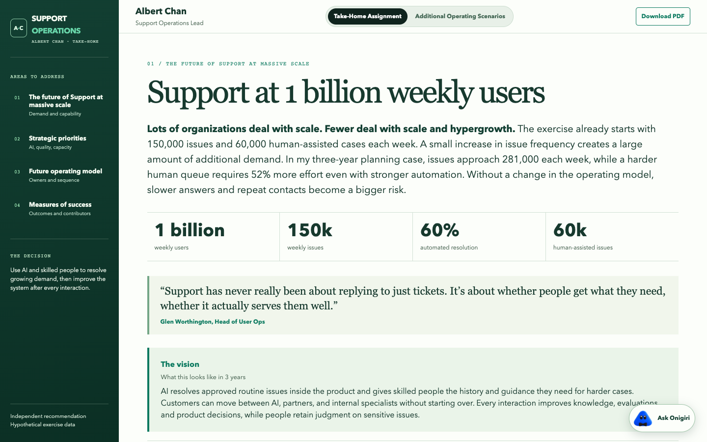
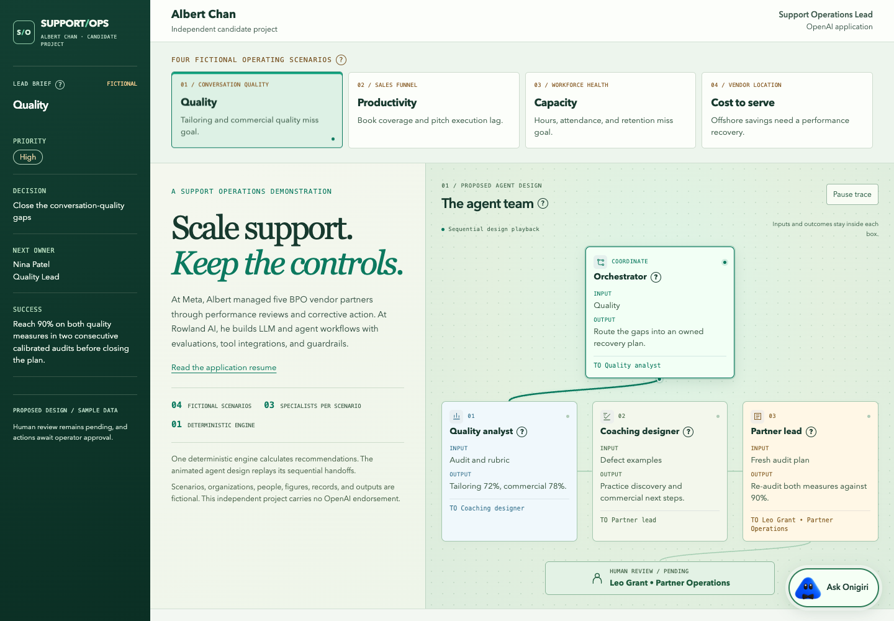

# Albert Chan | Support Operations Lead

**[View the take-home assignment](https://support-operations-albert-chan.albe88948804.chatgpt.site/)** · [Explore additional operating scenarios](https://support-operations-albert-chan.albe88948804.chatgpt.site/operating-scenarios.html) · [Download the PDF](src/assets/Albert-Chan-OpenAI-Support-Operations-Take-Home.pdf)

This repository contains my recommendation for the hypothetical OpenAI Support Operations take-home. The ChatGPT Site is the shareable presentation. GitHub keeps the source, the PDF, and the fictional operating examples available for review.



## The recommendation

The assignment asks how Support should evolve over three years from a hypothetical baseline of 1 billion weekly users, 150,000 weekly issues, and 60% automated resolution. I organize the recommendation around the assignment's four areas covering future scale, strategic priorities, operating model, and measures of success. My proposal uses AI to resolve approved routine issues, support people on complex cases, and improve guidance and product decisions after each interaction.

The planning case shows Year 1, Year 2, and Year 3 demand, human cases, and effort in a chart and a supporting table. It explains the logic behind each assumption, the investments and trade-offs, the partner operating model, a customer-outcome scorecard, and an action plan with owners and illustrative readiness statuses. The only external research link in the recommendation is [OpenAI's published support model](https://openai.com/index/openai-support-model/).

The scorecard translates measures I used in Meta sales and vendor programs into appropriate Support measures. Those sales measures are distinct from OpenAI results. The figures for future growth and automation are scenario assumptions, separate from OpenAI targets.

## Additional Operating Scenarios

The second tab contains four fictional cases covering quality, productivity, capacity, and cost to serve. Each case shows a proposed specialist handoff, evidence, diagnosis, owner, and recovery plan. The agent chart is a visual replay of one deterministic browser engine. It replays proposed handoffs without separate agents, live support systems, or executed actions.



## Review and run locally

- [Architecture and production boundary](docs/architecture.md)
- [Four scenario details](docs/scenarios.md)
- [Hiring-manager walkthrough](docs/walkthrough.md)
- [Source and assumption map](docs/source-map.md)

Node.js and Python are sufficient for local review. The project has no package dependencies.

```sh
npm test
npm run lint
npm run build
npm run preview
```

GitHub Actions checks the project and publishes a lightweight redirect from GitHub Pages to the ChatGPT Site. The full source and PDF remain in this repository.
